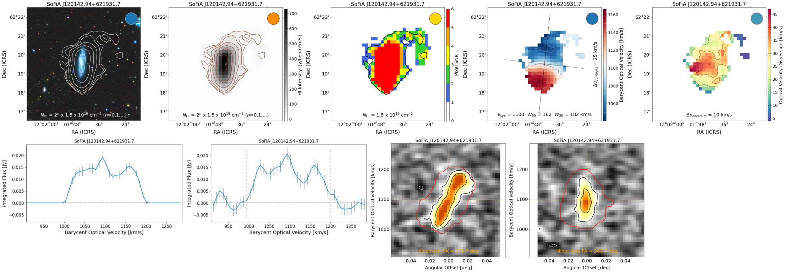

SoFiA Image Pipeline (SIP)
=====
[](https://zenodo.org/badge/latestdoi/455147174)

Introduction
------------
SIP takes a SoFiA generated source catalog and produce images for publication or quick inspection.  Images include HI contours overlaid on multiwavelength images, HI moment maps, pixel-by-pixel SNR maps, pv-diagrams with SoFiA mask, and spectra with and without noise.



Requirements
------------
This code has been developed and tested with Python 3.9.7.

Python dependencies can be installed with: \
`pip install -r requirements.txt`

Combining individual images with the `-m` option requires [ImageMagick](https://imagemagick.org) be installed.

SIP was written with the outputs from SoFiA 2.4.1 (bba8c43) and later. Through troubleshooting, we have improved the output of both SIP and [SoFiA-2](https://github.com/SoFiA-Admin/SoFiA-2), so for best performance, please use the latest version of each. 

For the best SIP unit conversion performance, SoFiA-2 needs to have been run with the following parameters: \
`parameter.wcs = True` \
`parameter.physical = True` \
`parameter.offset = True`


Installation
------------

#### Method 1:
Fork to your own repository and do a git clone.


#### Method 2:
We are working on a pip install option. More later. 
<!--- `pip3 install` --->


Usage
-----
SIP works under the assumption that the user has run [SoFiA-2](https://github.com/SoFiA-Admin/SoFiA-2) which generated an xml and/or ascii catalog file, and fits moment maps and cubelets for each source.  SIP assumes that these filese are in the same directory structure as created by SoFiA-2 where the catalog file and `*_cubelet/` folder are in the same directory.  The output from SIP will be in a newly created folder next to `*_cubelets/` called `*_figures/`.

Get help on the parameters: 
* `python3 image_pipeline.py -h`

Examples:
* Use the xml catalog file to output images in default png format: \
`python3 image_pipeline.py -c <path/to/catalog.xml>`

* Use ascii catalog file with output images in pdf format and specify original data set to plot full noise spectrum: \
`python3 image_pipeline.py -c <path/to/catalog.txt> -x pdf -o <path/to/original_cube.fits>` 

* Request HI contours on multiple survey images, separated by a space, and make a combined image for each source: \
`python3 image_pipeline.py -c <path/to/catalog.txt> -s panstarrs 'GALEX Far UV' -m`

* Using the latest official Docker image
`docker run -it -v <cwd>/<folder>:/app/<folder> sofia-pipeline/image_pipeline:latest -c <folder>/<catalog.xml>`

### Options
```
REQUIRED:
    -c     Catalog file. Can be the ascii file ending in .txt or the XML file from SoFiA-2.
    
OPTIONAL:
    -x     Output image file type. Any file type accepted by plt.savefig() is in theory valid.  Default is 'png'.
    -o     Path to the original data file on which source finding was conducted. This allows the spectrum with noise to be plotted over the full spectral range of the original cube.  
    -b     Synthesized beam dimensions. If the primary header of the FITS files do not contain the beam information, this can be provided by the user. Accepts 1 to 3 values in order (bmaj, bmin, bpa).
    -i     Minimum image size (ARCMIN). Images will be square. If an HI source exceeds the requested size, a larger image to fit the HI contours will be generated. Default is 6 arcmin.
    -snr   Specify the SNR range within which to plot the lowest HI contour. Requires 2 values. Default is [2.0, 3.0].
    -s     List of surveys on which to overlay HI contours. Only the first entry will be used in the combined image if `-m` option is used. Default is 'DSS2 Blue'.
    -m     Make a combined image using ImageMagick.  If a path is provided after this option, it is assumed to be the path to the `convert` executable of ImageMagick. 
    -ui    User supplied image for overlaying HI contours.  Can use this in combination with `-s` and a list of surveys.
    -ur    Percentile range when plotting the user supplied image.  Requires two values. Default is [10., 99.].
```

Test data cube
--------
The SoFiA test data cube can be found through the SoFiA-2 wiki [here](https://github.com/SoFiA-Admin/SoFiA-2/wiki#test-data-cube) (14.2 MB).
This cube contains HI emission from several galaxies around NGC 4036.

The current version of this repo also has a test data set (without instructions) in the `test_data/` folder.  The cube contains HI emission from several galaxies around UGC 7012.

Advanced tips
--------
* If you have a large catalog of sources, start by testing SIP with just a small subset (copy the catalog with the full SoFiA header formatting, but keeping only the first couple sources.)  Make sure the image and text outputs from SIP for those sources are as you expect.  Adjust optional variables as necessary.  Run on your larger catalog.

* In addition to overlaying HI contours on survey images available through `astroquery`, a user can request false color images from `'decals'`, or `'panstarrs'`, or gray scale HST-ACS Mosaic images for sources within the COSMOS field with `'hst'`.  The HST image size is currently hardcoded to 40 arcsec on a side. 

* Available surveys from `astroquery` can be found by running:
```
from astroquery.skyview import SkyView
SkyView.list_surveys()
# or 
SkyView.survey_dict
```

* Downloading survey images from `astroquery.SkyView` is the greatest limiting factor in the speed of SIP.  To avoid this, for catalogs with a high source density, you may consider downloading one large image to disk before running SIP.  For this purpose, we have included `overview_fig.py`. For example:
```
python3 overview_fig.py -h
python3 overview_fig.py -ra 174.465 -dec 21.9743 -i 0.5 -s 'Survey Name' -o my_image
python3 image_pipeline.py -c <path/to/catalog.xml> -ui <my_image_SurveyName.fits>
```

* SIP always outputs individual figures for each SoFiA FITS file.  If you did not produce a combined summary image with the `-m` option, you can still create it without re-running SIP if you have ImageMagick installed.  Here is example python code using a for loop over the sources to execute terminal commands.
```
convert_im = "/usr/local/Cellar/imagemagick/7.1.0-13/bin/convert"
for src in sources:
    print("  {}".format(src))
    new_png = "{}_combo.png".format(src)
    survey = "dss2blue"
    os.system("{} {}_mom0_{}.png {}_mom0.png {}_snr.png {}_mom1.png +append temp.png".format(convert_im, src, survey, src, src, src, src))
    os.system("{} {}_spec.png -resize 125% temp2.png".format(convert_im, src))
    os.system("{} {}_specfull.png -resize 125% temp3.png".format(convert_im, src))
    os.system("{} temp2.png temp3.png {}_pv.png +append temp4.png".format(convert_im, src, src, src))
    os.system("{} temp.png temp4.png -append {}".format(convert_im, new_png))
    os.system('rm -rf temp.png temp2.png temp3.png temp4.png')
```
On your system, you will likely be able to replace `/usr/local/Cellar/imagemagick/7.1.0-13/bin/convert` with simply `convert`.  Note `+` or `-` in front of `append` controls if the images are combined horizontally or vertically.
This example places all images on two rows, with the spatial plots on the top row and the spectral plots on the bottom row. 


Known Issues
--------
See the github repo for known bugs and desired enhancements.  We aim to fix serious bugs as quickly as possible.

In addition we are aware of the following issues:
* Saving figures with .ps or .eps format has issues with transparency and background colors appearing black.
* `overview_fig.py` can download full color images from PanSTARRS and DECaLS, but these can not yet be read as user supplied input to `image_pipeline.py`
* The mask (red line) on pv-diagram plots may not be perfectly aligned from left-to-right.  Please use this line only as a rough indication of the mask position.  Refer to actual data for the truth.  Any suggestions for how to improve this are welcome.
* For data with channels that are not uniform in width (e.g. `SPECSYS = FELO-OPT`), SIP's conversion to km/s is off compared to SoFiA-2's: the programs use formula from [here](https://www.astro.rug.nl/software/kapteyn/spectralbackground.html#aips-axis-type-felo) or use wcslib to do the conversion, respectively.  We haven't tracked down the discrepancy.  To the best of our knowledge, only relatively old radio data observing nearby galaxies, might be in this `FELO` format. 
* No exceptions are caught for `socket.timeout` during downloads (seen for `-s panstarrs` when image requested was 20.5 arcmin). We've noticed that simply rerunning the request at a later time has solved the issue.

### Other caveats
* SIP is not guaranteed to work with output from SoFiA-1. It may produce images, but these may not have the correct units, reference frame, or SIP may crash entirely. Because SoFiA-1 is no longer being developed, there are no plans to make SIP work around these issues.
* The SIP code and documentation is still a work in progress.  Thanks for your patience and suggestions for improvement.

Version history
---------------
* SIP 1.0.0
    * Released 18 April 2022
    
Copyright and licence
---------------------
SIP was created by Kelley M. Hess

© 2022 Kelley M. Hess

This programme is free software: you can redistribute it and/or modify it 
under the terms of the GNU General Public License as published by the Free 
Software Foundation, either version 3 of the License, or (at your option) any 
later version.

This programme is distributed in the hope that it will be useful, but **without 
any warranty**; without even the implied warranty of **merchantability** or **fitness 
for a particular purpose**. See the GNU General Public License for more details.

You should have received a copy of the GNU General Public License along with 
this programme. If not, see http://www.gnu.org/licenses/.
